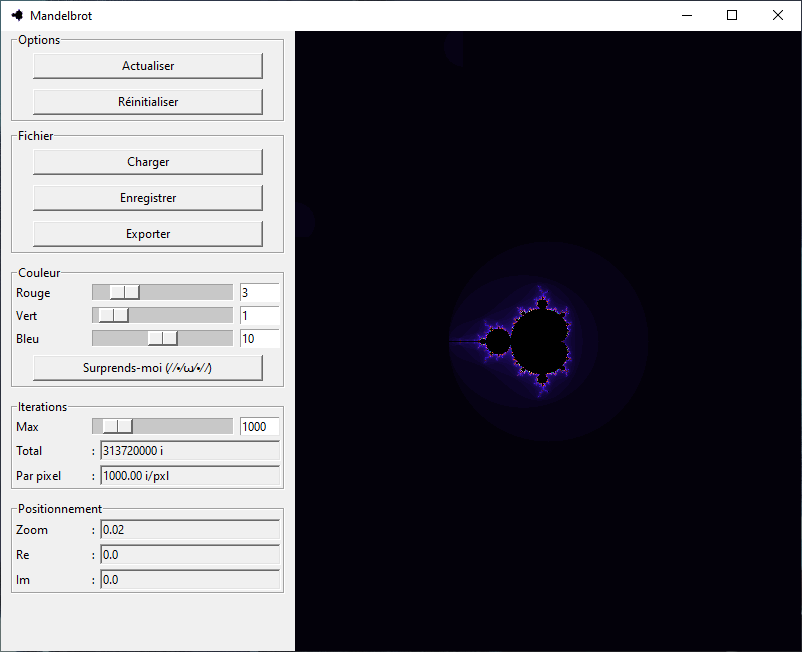
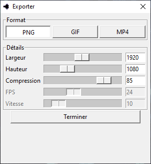
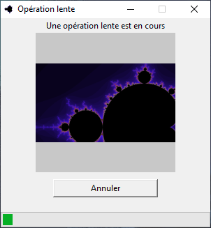

#  Mandelia


---

Application to visualize the fractal of mandelbrot and julia.

## Installation

### Linux

```sh
git clone https://github.com/Dashstrom/mandelia.git
pip install .
python3 -m mandelia
```

### Windows

```sh
git clone https://github.com/Dashstrom/mandelia.git
py setup.py exe
.\dist\Mandelia.exe
```

## Preview

### Main window



### Export Window



### Operation Window



## Made with


